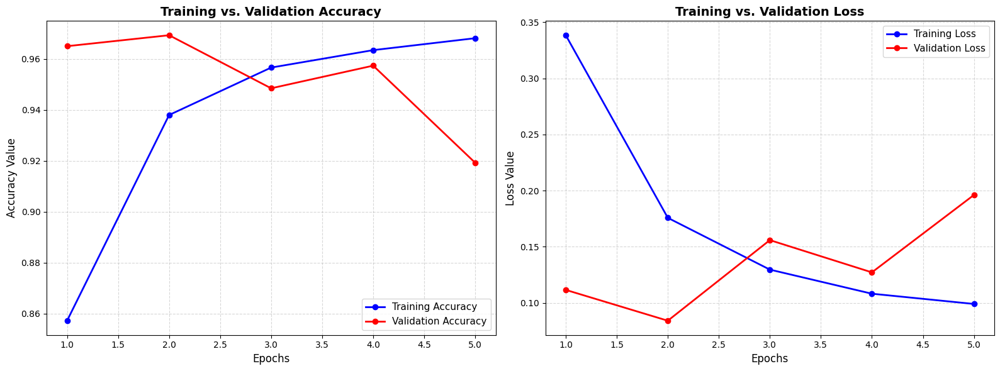

# 🚗 Adaptive Real-Time Drowsiness Detection System with Online Fine-Tuning

<p align="center">


</p>

---

## 📌 Project Overview

Driver fatigue is one of the leading causes of road accidents worldwide. This project presents an **Adaptive Real-Time Drowsiness Detection System** that combines classical computer vision techniques with deep learning to continuously monitor a driver's eye state using a webcam.

The system detects the driver's face and eyes using **OpenCV Haar Cascade classifiers**, classifies eye states using a custom **Convolutional Neural Network (CNN)**, and triggers an audible warning when prolonged eye closure indicates drowsiness.

Unlike conventional driver monitoring systems, this project also incorporates an **Online Fine-Tuning Engine** that collects difficult samples during runtime and incrementally updates the CNN after each monitoring session. This allows the model to gradually adapt to new users, camera positions, and lighting conditions without requiring complete retraining.

---

# ✨ Features

- 👁️ Real-time eye state detection
- 📷 Live webcam monitoring
- 🧠 CNN-based binary eye classification
- ⚡ OpenCV Haar Cascade face & eye localization
- 🔔 Automatic drowsiness alarm after prolonged eye closure
- ⏱️ Timer-based false alarm reduction
- 🔄 Session-based online fine-tuning
- 💾 Automatic model weight updates
- 📊 Live prediction visualization
- 🎯 Lightweight architecture for real-time inference

---

# 📂 Project Structure

```text
Adaptive-Drowsiness-Detection/
│
├── Drowsiness_Detection_System.ipynb
├── Detector.py
│
├── models/
│   └── model.h5
│
├── images/
│   └── model_performance.png
│
├── sounds/
│    └── alarm.mp3
│
├── requirements.txt
└── README.md
```

---

# 🛠 Technology Stack

| Category | Technology |
|-----------|------------|
| Programming Language | Python |
| Deep Learning | TensorFlow / Keras |
| Computer Vision | OpenCV |
| Numerical Computing | NumPy |
| Alarm System | playsound |
| Parallel Processing | threading |
| Model Training | TensorFlow Keras |
| Face Detection | Haar Cascade |
| Eye Detection | Haar Cascade |

---

# ⚙ Installation

Clone the repository

```bash
git clone https://github.com/yourusername/Adaptive-Drowsiness-Detection.git

cd Adaptive-Drowsiness-Detection
```

Install dependencies

```bash
pip install -r requirements.txt
```

---

# ▶️ Running the Project

The project consists of two main components:

- **Training Notebook (`Drowsiness_Detection_System.ipynb`)** – Used for data preprocessing, CNN model training, evaluation, and saving the trained model (`model.h5`).
- **Detector Script (`Detector.py`)** – Loads the trained model and performs real-time drowsiness detection using a webcam.

---

## Step 1: Train the Model

Open the Jupyter notebook and execute all cells sequentially.

```bash
jupyter notebook
```

Open:

```text
Drowsiness_Detection_System.ipynb
```

The notebook performs the following tasks:

- Loads the MRL Eye Dataset
- Preprocesses the images
- Applies data augmentation
- Builds the CNN architecture
- Trains the model
- Evaluates model performance
- Saves the trained weights as:

```text
model.h5
```

---

## Step 2: Start Real-Time Detection

Once `model.h5` has been generated, run the detector script.

```bash
python detector.py
```

The detector will:

- Initialize the webcam
- Detect the user's face
- Detect both eyes using Haar Cascade classifiers
- Preprocess the detected eye images
- Predict the eye state using the trained CNN
- Display live predictions on the webcam feed
- Trigger an alarm if the eyes remain closed for more than **5 seconds**
- Collect difficult samples for online fine-tuning

---

## Step 3: End the Session

Press **`Q`** to terminate the application.

If closed-eye samples were collected during the session:

- The CNN is automatically fine-tuned.
- Updated weights are saved to:

```text
model.h5
```

The improved model will be used automatically the next time `Detector.py` is executed.

# 📊 Dataset

## Dataset Source

**MRL Eye Dataset**

https://www.kaggle.com/datasets/akashshingha850/mrl-eye-dataset

---

## Dataset Description

The model is trained using the **MRL Eye Dataset**, a publicly available dataset containing grayscale eye images captured under different lighting conditions, camera angles, and facial variations.

The dataset provides sufficient diversity for learning robust binary eye-state classification.

### Dataset Statistics

| Property | Value |
|----------|------:|
| Total Images | ~85,000 |
| Open Eye Images | ~43,000 |
| Closed Eye Images | ~42,000 |
| Classes | 2 |
| Image Type | Grayscale |

---

## Class Labels

| Label | Eye State |
|-------|-----------|
| 0 | Closed Eye |
| 1 | Open Eye |

---

# 🧪 Image Preprocessing

Before training or inference, every eye image undergoes several preprocessing operations to improve model robustness.

## Preprocessing Pipeline

```text
Raw Image
      │
      ▼
Grayscale Conversion
      │
      ▼
Eye Crop
      │
      ▼
Resize (64 × 64)
      │
      ▼
Normalization [0,1]
      │
      ▼
Tensor Conversion
      │
      ▼
CNN Input
```

---

## Data Augmentation

To improve generalization, several augmentation techniques are applied during training.

- Random Rotation
- Horizontal Shift
- Vertical Shift
- Zoom
- Brightness Variation
- Horizontal Flip
- Rescaling

These augmentations help the CNN become invariant to lighting changes, camera angles, and facial variations.

---

# 🧠 CNN Model Architecture

The proposed model is a lightweight Convolutional Neural Network (CNN) designed specifically for real-time eye-state classification.

The architecture progressively extracts spatial features using convolutional layers while reducing spatial dimensions through max-pooling. Batch normalization stabilizes learning, whereas dropout regularization prevents overfitting.

---

## Architecture Overview

```text
Input (64×64×1)
        │
        ▼
Conv2D (16 Filters)
        │
        ▼
Batch Normalization
        │
        ▼
MaxPooling
        │
        ▼
Conv2D (32 Filters)
        │
        ▼
Batch Normalization
        │
        ▼
MaxPooling
        │
        ▼
Conv2D (64 Filters)
        │
        ▼
MaxPooling
        │
        ▼
Batch Normalization
        │
        ▼
Flatten
        │
        ▼
Dense (32)
        │
        ▼
Dropout (0.5)
        │
        ▼
Dense (16)
        │
        ▼
Dropout (0.5)
        │
        ▼
Dense (1)
        │
        ▼
Sigmoid Output
```

---

## Layer Configuration

| Layer | Output Shape | Activation | Description |
|--------|--------------|------------|-------------|
| Input | (64,64,1) | — | Grayscale eye image |
| Conv2D | (62,62,16) | ReLU | Feature extraction |
| BatchNorm | (31,31,16) | — | Faster convergence |
| MaxPool | (31,31,16) | — | Downsampling |
| Conv2D | (29,29,32) | ReLU | Higher-level features |
| BatchNorm | (14,14,32) | — | Stabilization |
| MaxPool | (14,14,32) | — | Downsampling |
| Conv2D | (12,12,64) | ReLU | Deep feature extraction |
| BatchNorm | (6,6,64) | — | Feature normalization |
| MaxPool | (6,6,64) | — | Downsampling |
| Flatten | 2304 | — | Converts feature maps into vector |
| Dense | 32 | ReLU | Fully connected layer |
| Dropout | 32 | — | Regularization |
| Dense | 16 | ReLU | Hidden layer |
| Dropout | 16 | — | Regularization |
| Output | 1 | Sigmoid | Binary classification |

---

## Training Configuration

| Parameter | Value |
|-----------|------:|
| Optimizer | Adam |
| Loss Function | Binary Crossentropy |
| Batch Size | 32 |
| Epochs | 5 |
| Learning Rate | 0.001 |
| Input Shape | (64 × 64 × 1) |

---

## Model Characteristics

- Lightweight CNN architecture
- Optimized for real-time inference
- Binary eye-state classification
- Dropout regularization to reduce overfitting
- Batch Normalization for stable optimization
- Sigmoid activation for probability estimation

---

# 📈 Model Performance

The CNN model was trained for **5 epochs** using the MRL Eye Dataset. During training, both training and validation metrics were monitored to evaluate convergence, generalization capability, and possible overfitting.

---

## Training Metrics (As per my training, the results may vary when you run)

| Epoch | Training Accuracy | Validation Accuracy | Training Loss | Validation Loss |
|:-----:|:-----------------:|:-------------------:|:-------------:|:---------------:|
| 1 | 85.7% | 96.5% | 0.339 | 0.111 |
| 2 | 93.8% | **97.0%** | 0.176 | **0.084** |
| 3 | 95.7% | 94.9% | 0.129 | 0.156 |
| 4 | 96.3% | 95.8% | 0.108 | 0.127 |
| 5 | **96.8%** | 91.9% | **0.099** | 0.196 |

---

## Performance Analysis

The training curves indicate rapid convergence during the initial epochs. Validation accuracy reaches its peak at **97.0%** during **Epoch 2**, after which the training accuracy continues to improve while validation performance gradually decreases.

This divergence suggests the onset of **overfitting**, where the model begins memorizing the training data rather than learning generalized features.

### Observations

- Training accuracy continuously increases.
- Training loss steadily decreases.
- Validation accuracy peaks early before declining.
- Validation loss begins increasing after Epoch 2.

For deployment, the checkpoint obtained after **Epoch 2** provides the best balance between accuracy and generalization.

---

## Performance Visualization

<p align="center">

</p>

<p align="center">
<i>Training vs Validation Accuracy and Loss</i>
</p>

---

# 🔍 Real-Time Prediction

After training, the CNN model is deployed for **real-time drowsiness detection** using OpenCV and a webcam.

Each video frame undergoes face detection, eye localization, preprocessing, and CNN inference before determining whether the user's eyes are open or closed.

---

## Real-Time Prediction Pipeline

```text
Webcam Feed
      │
      ▼
Capture Frame
      │
      ▼
Convert to Grayscale
      │
      ▼
Face Detection
      │
      ▼
Eye Detection
      │
      ▼
Eye Crop
      │
      ▼
Resize (64 × 64)
      │
      ▼
Normalization
      │
      ▼
CNN Prediction
      │
      ├──────────────┐
      ▼              ▼
Open Eye        Closed Eye
      │              │
      │        Start Timer
      │              │
      │              ▼
      │      Closed > 5 Seconds?
      │              │
      │        ┌─────┴──────┐
      │        ▼            ▼
Continue    Trigger      Store Frame
Monitoring   Alarm            │
                              ▼
                     Online Fine-Tuning
                              │
                              ▼
                     Save Updated Model
```

---

## Prediction Workflow

### 1. Webcam Initialization

The webcam continuously captures live video frames using OpenCV.

```python
cv2.VideoCapture(0)
```

---

### 2. Face Detection

Each frame is converted to grayscale before applying OpenCV's Haar Cascade classifier to detect the driver's face.

---

### 3. Eye Detection

The eye detector searches only inside the detected facial region, significantly reducing computational overhead and false detections.

---

### 4. Image Preprocessing

Each detected eye is:

- Cropped
- Resized to **64×64**
- Normalized to **[0,1]**
- Converted into a CNN-compatible tensor

---

### 5. CNN Inference

The processed eye image is passed to the trained CNN.

Output classes:

| Prediction | Eye State |
|------------|-----------|
| =< 0.5 | Open |
| > 0.5 | Closed |

---

### 6. Live Visualization

The application displays

- Face bounding box
- Eye bounding box
- Eye state
- Drowsiness timer
- Alarm status

directly on the webcam stream.

---

# ⏱️ Drowsiness Detection Strategy

Instead of triggering an alarm immediately after detecting a closed eye, the system continuously monitors eye closure duration.

### Detection Logic

- Eye closes
- Timer starts
- Eye opens → Timer resets
- Eye remains closed for **5 seconds**
- User classified as **Drowsy**
- Alarm activated

This timer-based strategy minimizes false alarms caused by natural blinking.

---

# 🔔 Alarm System

Once prolonged eye closure is detected:

- An audio alarm is played.
- Alarm playback runs in a separate thread.
- The detection pipeline continues without interruption.
- Alarm automatically resets after playback.

Using multithreading ensures real-time performance during continuous monitoring.

---

# 🔄 Online Fine-Tuning

One of the most distinctive features of this project is its **Online Fine-Tuning Engine**.

Rather than discarding difficult predictions, the system learns from them.

---

## Fine-Tuning Workflow

Whenever prolonged drowsiness is detected:

- Closed-eye frames are collected.
- Samples are stored in memory.
- At application exit:
  - Samples are converted into a new dataset.
  - The CNN is recompiled.
  - Fine-tuning is performed for **5 epochs**.
  - Updated weights are saved automatically.

---

## Online Learning Pipeline

```text
User Drowsy
       │
       ▼
Collect Closed Eye Frames
       │
       ▼
Store in Memory
       │
       ▼
Exit Application
       │
       ▼
Prepare Dataset
       │
       ▼
Fine-Tune CNN
       │
       ▼
Save Updated model.h5
```

---

## Benefits

- Adapts to different users.
- Learns from difficult samples.
- Improves robustness over multiple sessions.
- Eliminates the need for complete retraining.
- Enhances long-term deployment performance.

---

# 📊 Results

The proposed system successfully demonstrates:

- High eye-state classification accuracy.
- Stable real-time inference.
- Low computational overhead.
- Robust face and eye localization.
- Automatic drowsiness warning.
- Adaptive model improvement through online fine-tuning.

---

# ⚠️ Current Limitations

Although the system performs well, several limitations remain.

- Haar Cascades are sensitive to extreme head rotations.
- Performance decreases under poor lighting.
- Fine-tuning currently uses only closed-eye samples.
- No replay buffer is used, increasing the possibility of catastrophic forgetting.
- The system currently supports only monocular webcam input.

---

# 🚀 Future Improvements

Potential enhancements include:

- Replace Haar Cascades with **MediaPipe Face Mesh**.
- Implement blink-rate analysis.
- Add head pose estimation.
- Use TensorFlow Lite for edge deployment.
- Introduce replay-buffer-based continual learning.
- Deploy on Raspberry Pi or NVIDIA Jetson.
- Add fatigue score visualization.
- Develop a mobile application.

---

# 📚 References

1. **MRL Eye Dataset**

   https://www.kaggle.com/datasets/akashshingha850/mrl-eye-dataset

2. TensorFlow Documentation

   https://www.tensorflow.org/

3. OpenCV Documentation

   https://opencv.org/

4. Keras Documentation

   https://keras.io/

---

# 📄 License

This project is licensed under the **MIT License**.

Feel free to use, modify, and distribute this project for academic and research purposes.

---

# 👨‍💻 Author

**Devesh Yadav**

B.Tech Computer Science Engineering  
Delhi Technological University (DTU)

GitHub: https://github.com/devesh-yadav10

---

## ⭐ If you found this project helpful, consider giving it a star on GitHub!
